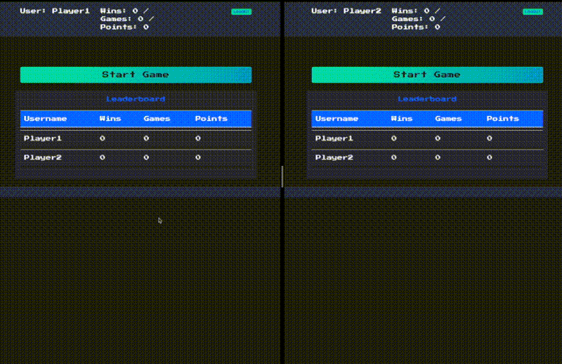

# Multiplayer Tetris

Browser based multiplayer Tetris game written in Python and Go using Catalyst (Dapr) for state and communication.
This is a demo project to show off the kind of things you can build with [Diagrid Catalyst](https://www.diagrid.io/catalyst).
The game is a bit of fun- there are very many ways you can cheat, stay honest (:



Watch the webinar on YouTube where Catalyst and the game are explained:

[](https://youtu.be/VS036hE6cvg)

## Prerequisites

- [Docker Desktop](https://docs.docker.com/get-docker/)
- [Nix](https://github.com/DeterminateSystems/nix-installer)

## Install dependencies

Now run the following.
Yes, you'll need to download the internet and compile Redis modules for a custom container image... be patient.

```bash
nix run
```

Now open http://localhost:5000 in either a single browser with another private tab, or two different browsers to play against yourself.

## Build Images:

```bash
nix run .#build-containers
```

or

```bash
make build
```

## Components

game:
- scorepubsub (pubsub.redis): Sends game results to `users` service.

users:
- scorepubsub (pubsub.redis): Receives game results from `game` service.
- kvstore (state.in-memory): Stores playing waiting in the lobby.
- userscores (state.redis): Stores user state consisting of username, hashed password, wins, points, and games played.

## APIs

game:
- PubSub (scorepubsub): Publishes game results to `users` consumer service.
- Service Invocation: Registers incoming games from `users` service with two players.

users:
- State Set/Get (kvstore): Stores users waiting in the lobby.
- State Set/Get (userscores): Stores user state consisting of username, hashed password, wins, points, and games played.
- State Query (userscores): List the top 20 players by wins.
- PubSub (scorepubsub): Receives game results from `game` producer service.
- Service Invocation: Registers two users ready to play a game with `game` service.

## Redis

We save user state as JSON objects in Redis with the key being the username.
We query the top 20 players by wins using Dapr's state Query API.
For this capability, Redis needs the RediSearch and RedisJSON modules loaded.
We didn't find an arm64 container image with these modules on the Internet, so we need to build our own here.

## More information
Do you want to try out Catalyst? Sign up for the [private beta](https://pages.diagrid.io/catalyst-early-access-waitlist)! Want to learn more about Catalyst? Join the [Diagrid Discourse](https://community.diagrid.io/) where application developers share knowledge on building distributed applications. Have you built something with Catalyst? Post it in the [Built with Catalyst](https://community.diagrid.io/t/built-with-catalyst/23) topic and get your item featured in the Diagrid newsletter.
